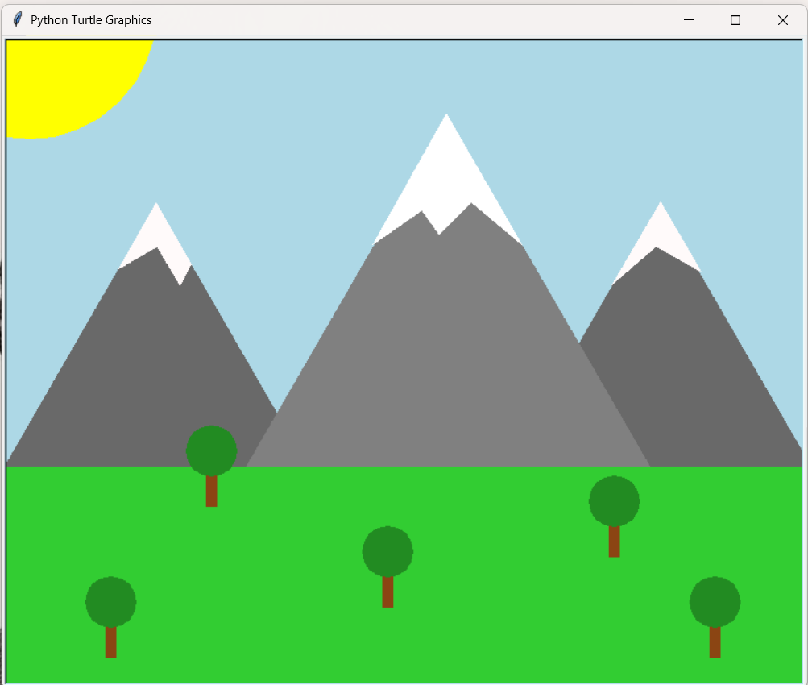

# 🌄 Scenic Landscape Generation Using Turtle Graphics

## 📌 Project Description

This project is a **computer graphics implementation** using Python’s **Turtle module** to create a scenic landscape. The scene consists of mountains, trees, grass, and the sun, showcasing fundamental **graphics concepts** such as:

- **Polygon Rendering** (Mountains)
- **Fractal Recursion** (Tree Structures)
- **Geometric Transformations** (Scaling & Translation)
- **Clipping & Visibility** (Layering of Objects)
- **Color Filling & Depth Perception**

This project serves as an **introduction to graphical programming** and helps in understanding how basic shapes and transformations can be used to create visually appealing landscapes.

## 📸 Output Preview

### 🎮 Terminal Output


### 🌄 Final Rendered Scene



## 🛠️ Technologies Used

- **Python** (Turtle Graphics)
- **Turtle Module** (for 2D Graphics)

## 🚀 How to Run the Project

1. Clone the repository:
   ```bash
   git clone <repo-url>
   cd <repo-project-folder>
   ```
2. Run the Python script:
   `bash
    python main.py
    `
   The Turtle graphics window will open, displaying the landscape.

## 📚 References

    Python Turtle Documentation: Turtle Module

## 🎯 Future Improvements

- Add animation effects (e.g., moving sun, swaying trees).
- Implement user interaction (click to plant more trees).
- Enhance the visual details with more advanced Turtle functions.
